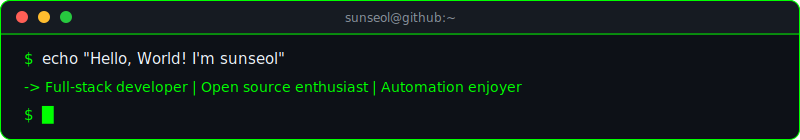

<div align="center">
  
</div>

```console
$ whoami
developer who mass-produces side projects and mass-abandons them
based in Korea
```

```console
$ cat interests.txt
├── systems programming
├── web development
├── open source
└── automation
```

```console
$ ls ./tech-stack/
```

<p>
  
  
  
  
  
  
</p>

```console
$ git log --oneline -5
```

<!--START_SECTION:activity-->
```text
building small tools
automating repetitive work
breaking things locally before they break in production
shipping experiments, archiving most of them
reading source code for fun and debugging for peace
```
<!--END_SECTION:activity-->

```console
$ neofetch
```

<div align="center">
  
  
</div>

<br />

<div align="center">
  
</div>

```console
$ echo $CONTACT
├── github: https://github.com/sunseol
├── blog: coming soon
└── email: available on request
```

<div align="center">
  
</div>

```console
$ exit
```
